  

  

  

<table>

<tr>

<td width="45%" align="center" valign="top">

</td>

<td width="65%" valign="top">

## 💫 About Me

- 🎓 **Final-Year B.Tech (CSAIML)** student at **Pranveer Singh Institute of Technology**

- 💻 **Software Engineer** passionate about building scalable backend systems and AI-powered applications

- ☕ **Tech Stack:** Java, Spring Boot, React, Node.js, Python, MySQL, MongoDB & Docker

- 🤖 **Currently exploring** AI Agents, RAG systems, LLM integrations, and cloud technologies

- 🧩 **Strong foundation** in Data Structures & Algorithms with hands-on full-stack project experience

- 🌱 **Always learning** new technologies and building projects that solve real-world problems

- 🤝 **Open to** internships, open-source collaborations, and exciting software engineering opportunities

- ⚡ **Fun Fact:** I somehow finish projects right before the deadline... and they still work. 😄

</td>

</tr>

</table>

---

## 🌟 Featured Projects

### 🚀 

**Uplifters.Net** is a web-based donation and volunteer management platform designed to connect donors with causes related to clothing, food, and education support.

**Tech**: HTML, CSS, JavaScript

**Features**: Category-based donations, real-time impact cards and counters, responsive UI, visual testimonials.

### 🎟️ 

An all-in-one event management platform with ticketing, marketing, and analytics.

**Tech**: React, Node.js, Express, MongoDB, Stripe, Google Analytics

**Features**: Intuitive dashboard, real-time insights, secure transactions.

### 🤖 

An AI-powered mock interview platform with personalized feedback and industry-specific questions.

**Tech**: Angular, Python, Flask, PostgreSQL, NLP

**Features**: AI simulations, instant feedback, progress tracking.

## 📊 GitHub Analytics

  
  

  

<!-- 📈 Contribution Activity Graph -->

<table>
<tr>
<td width="50%" valign="top">

</td>
<td width="50%" valign="top">

</td>
</tr>
</table>

## 🌐 Connect with Me

## 🙌 Thank You for Visiting!
I'm always excited to connect, collaborate, or answer questions. Feel free to reach out!

  

## 
